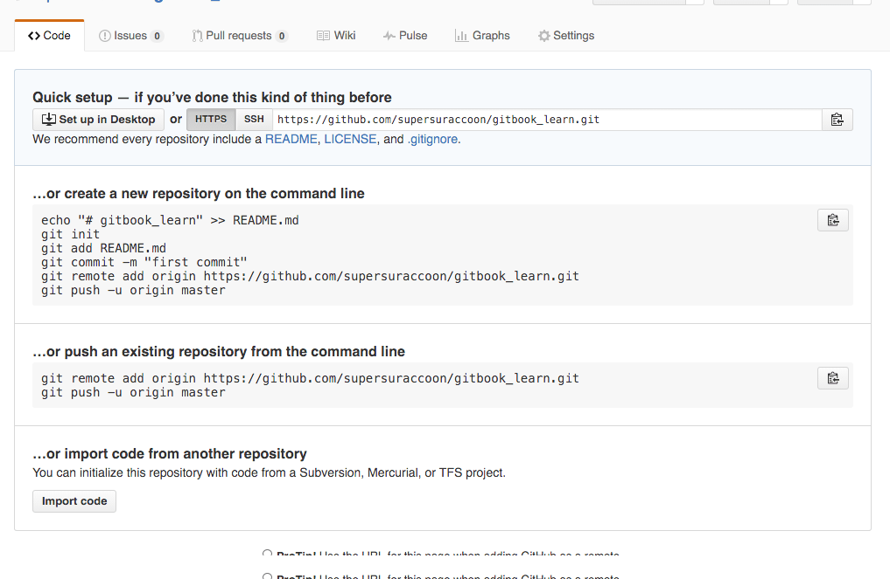
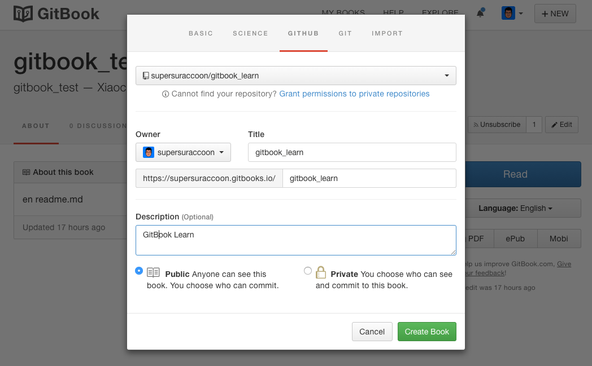

# GitBook && GitHub
___

## Create repository
Create a repository in `GitHub` to keep the book source.

## Create a local clone
Clone the repository to local to add the book source.

## Create a Book 
Create a new book on `GitBook` by `import from GitHub`

## Build the Book
`GitBook` will build the book for us using the source hosted on `GitHub` then.

