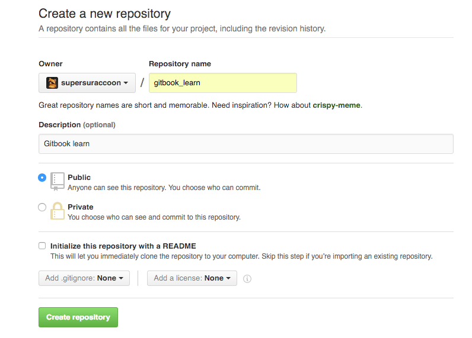
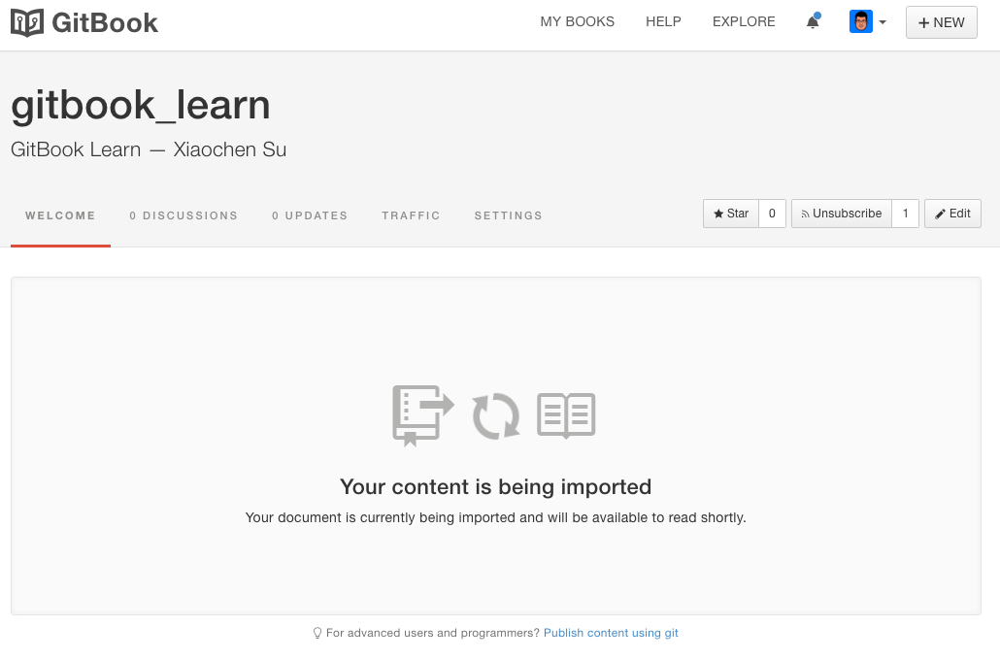

# GitBook && GitHub
___

## 创建仓库
在 `GitHub` 上创建一个仓库用于存放书籍的代码。

## 本地克隆
将创建的仓库克隆至本地，在其中进行书籍的编写和提交。

## 创建书籍
在 `GitBook` 上通过 `import from GitHub` 的形式创建新的书籍。

## 自动构建
`GitBook` 会从绑定的 `GitHub` 仓库自动拉取最新的代码，并自动构建生成新的书籍内容。

